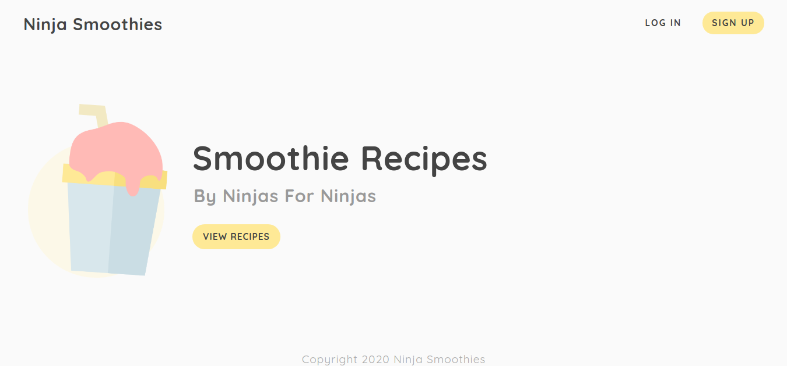

# Ninja Smoothies

## 🛠️ Tools

- Embedded JavaScript (ejs)
- Node.js
- MongoDB (mongoose)
- Bcrypt
- JWT
- Cookie Parser

---

## :bookmark_tabs: Concepts

- Setup:
  - Installing packages and understanding basic (ejs) structure
- Auth Routes & Controllers:
  - Creating routes for sign up, log in, home page and smoothies' pages
- Testing Routes & Handling POST Requests:
  - Using client app (Postman or Insomnia) to send HTTP requests
- User Model:
  - Defining mongoose schema
- Mongoose Validation:
  - Configuring attributes restrictions
- Mongoose Hooks:
  - Methods to be executed before and after a request submission
- Hashing Passwords:
  - Sending hashed passwords to database
- Auth Views:
  - Construction of log in and sign up pages
- Cookies Primer:
  - Understanding how cookies work
- JSON Web Tokens:
  - Theory on JSON Web Tokens
- Logging Users In and Out:
  - Creating and removing token to allow/block users access to smoothies' page
- Protecting Routes
  - Creating middleware to handle token validation
  - Creating middleware to retrieve logged user
- Conditional Rendering:
  - Displaying logged user (email inside the header)

---

### 📝 Notes

- Showing cookies at the console (if _httpOnly_ is false): `document.cookie`
- JWT Signing:
  - **Headers**: Tells the server what type of signature is being used (meta)
  - **Payload**: Used to indetify the user (e.g. contains user id)
  - **Signature**: Makes the token secure (like a stamp of autheticity)

---

### :ballot_box_with_check: Result

